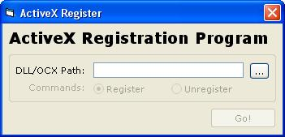



## A Simple ActiveX Registrar

### Description

Again, sorry for the lack of submissions in the lst few hours, I had some work to do. Anyway here is an ActiveX DLL/OCX registrar. It is simple enough that a beginner can learn this by compiling the class file and intergate it with their own programs. Don't forget to vote...
 
### More Info
 

             |
---                |---
**Submitted On**   |2003-08-08 17:36:12
**By**             |[dsmfdsjfnhdksfjdsk](https://github.com/Planet-Source-Code/PSCIndex/blob/master/ByAuthor/dsmfdsjfnhdksfjdsk.md)
**Level**          |Intermediate
**User Rating**    |5.0 (20 globes from 4 users)
**Compatibility**  |VB 5\.0, VB 6\.0
**Category**       |[Coding Standards](https://github.com/Planet-Source-Code/PSCIndex/blob/master/ByCategory/coding-standards__1-43.md)
**World**          |[Visual Basic](https://github.com/Planet-Source-Code/PSCIndex/blob/master/ByWorld/visual-basic.md)
**Archive File**   |[A\_Simple\_A162638882003\.zip](https://github.com/Planet-Source-Code/dsmfdsjfnhdksfjdsk-a-simple-activex-registrar__1-47527/archive/master.zip)

